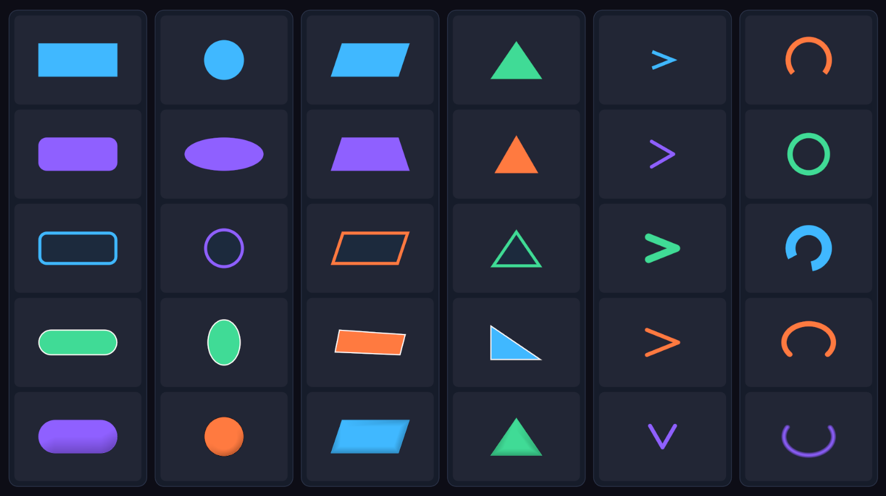

# SpriteLess UI

Sprite-free geometry graphics for Unity uGUI.

SpriteLess UI creates common UI shapes directly from `RectTransform` geometry. It uses the default uGUI material and does not require sprites, generated textures, or a custom SDF shader.



## Features

- Rounded Rectangle, Rectangle, and Pill
- Circle and Ellipse
- Parallelogram, Trapezoid, and convex Quadrilateral
- Isosceles, Equilateral, and Right Triangle types
- Chevron with Stretch or Equilateral proportions, direction, thickness, spread, cap, and join controls
- Arc and Ring with Flat or Round caps
- Uniform or individual corner radii
- Inside Border with anti-aliased inner edges
- Directional Edge Effect for lightweight button and panel depth
- Inset geometry anti-aliasing
- RectTransform-based normalized UV mapping for custom UI materials
- One `SpriteLessImage` component for every shape
- Button, Slider, Mask, RectMask2D, and Layout support
- Optional shape-accurate raycast area for non-rectangular buttons

## Requirements

- Unity 2021.3 LTS or newer
- Unity UI (`com.unity.ugui`) 1.0.0 or the version bundled with the Editor
- Git 2.14 or newer when installing from a Git URL

SpriteLess UI has no dependency on TextMesh Pro, a Scriptable Render Pipeline, generated textures, or custom shaders.

## Installation

Open `Window > Package Manager`, select **Install package from git URL**, and enter:

```text
https://github.com/DarknessTyranno/SpriteLess-UI.git?path=/Packages/io.github.darknesstyranno.spriteless-ui
```

## Usage

Create an element from:

```text
GameObject > UI (Canvas) > SpriteLess
```

Or add `SpriteLessImage` to a UI GameObject and select a shape in the Inspector.

Available presets include Rounded Rectangle, Circle, Parallelogram, Trapezoid, Ring, Arc, Triangle, Chevron, Panel, Button, and Slider.

### Triangle and Chevron

- Isosceles Triangle fills the RectTransform in the selected direction.
- Equilateral Triangle keeps equal side lengths and fits inside the RectTransform.
- Right Triangle fills three RectTransform corners selected through `Right Angle Corner`.
- Every Triangle type supports Fill, Border, Edge Effect, anti-aliasing, and Shape Raycast.
- Chevron is generated as one continuous stroke with Flat or Round caps and Miter or Round joins.
- Equilateral Chevron preserves the proportions of two sides of an equilateral triangle.
- Use Direction for common orientations and RectTransform Rotation only for arbitrary angles.
- Keep Transform Scale at `(1, 1, 1)` and resize with RectTransform Width and Height for consistent thickness.

### Raycast Area

- `Rect Transform` uses the full RectTransform rectangle and preserves standard uGUI behavior.
- `Shape` accepts pointer input only inside the generated shape, including Arc and Chevron thickness.
- Disable the inherited `Raycast Target` option for decorative graphics that do not receive input.

### Arc and Ring

- `0°` starts at the top.
- Positive Sweep values run clockwise.
- Negative Sweep values run counter-clockwise.
- A `360°` Sweep creates a closed Ring.

### Edge Effect

Edge Effect adds a directional color feather inside Rounded Rectangle, Circle, and Quadrilateral shapes. A direction of `(0, -1)` shades the bottom edge and can add lightweight depth without another UI object.

## Rendering

Fill, Border, Edge Effect, and anti-aliasing are generated as one CanvasRenderer mesh. Geometry is rebuilt only when the graphic or its `RectTransform` becomes dirty; no per-frame `Update` is used.

Every generated vertex receives normalized `uv0` coordinates from the RectTransform bounds: bottom-left `(0, 0)` to top-right `(1, 1)`. Custom uGUI-compatible materials can use these coordinates for gradients and procedural effects.

Assign a custom material from the `Material` field in the SpriteLessImage Inspector. The shader must preserve uGUI vertex color and alpha handling for Fill, Border, Edge Effect, and geometry anti-aliasing.

## License

MIT
